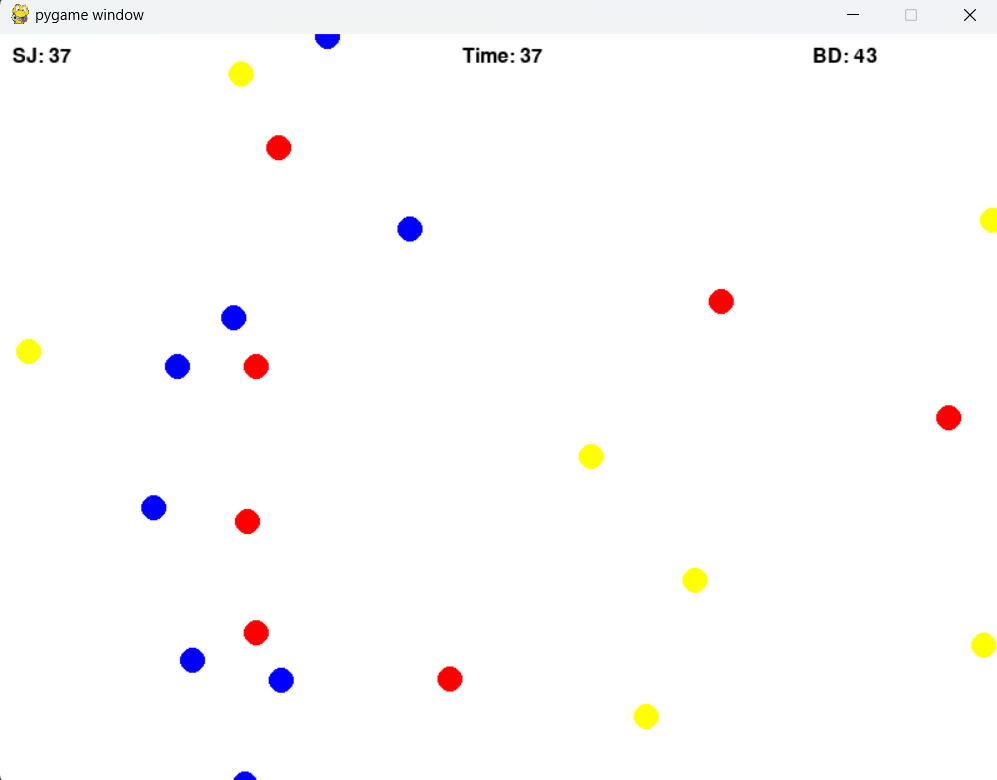

# Particle Wars

**Particle Wars** is a simple and engaging 2D simulation game built with Pygame, where red and blue particles engage in a strategic battle. Each team consists of particles with unique attributes and behaviors, fighting to be the last team standing.

## Features

- **Teams**: Two teams (red and blue) each with 10 particles.
- **Attributes**: Each particle has attack, defense, health, and range attributes.
- **Combat Mechanics**: Particles inflict damage on each other when in range, with damage scaling based on nearby allies and enemies.
- **Timer**: The game runs for 60 seconds, and the team with the most health remaining wins.
- **Dynamic Movement**: Particles move towards the nearest enemy, creating dynamic and strategic encounters.

## Installation

1. **Clone the repository**:
    ```sh
    git clone https://github.com/your-username/particle-wars.git
    cd particle-wars
    ```

2. **Install the required dependencies**:
    ```sh
    pip install pygame
    ```

3. **Run the game**:
    ```sh
    python particle_wars.py
    ```

## How to Play

- Launch the game by running the `particle_wars.py` script.
- Watch as the red and blue particles automatically engage in battle.
- The game lasts for 60 seconds.
- The winner is determined based on the total remaining health of each team's particles.
- Check the console output for the winning team at the end of the game.

## Screenshots



## License

This project is licensed under the MIT License - see the [LICENSE](LICENSE) file for details.
